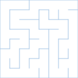
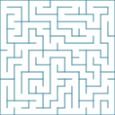
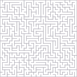

# SVG Maze Generator

This program generates pseudorandom rectangular mazes and outputs the result
as an SVG image.

Examples:

```
svgmaze -rexample1 -w8 -h8 -c16 -f'rgb(167,199,231)' -osvg > example1.svg
svgmaze -rexample2 -w16 -h16 -c8 -f'#398AA2' -osvg > example2.svg
svgmaze -rexample3 -w32 -h32 -c4 -f'#B8B5BE' -osvg > example3.svg
```

|  |  |  |

## Usage:

```
svgmaze [Options]
 -w<n>   Width of Maze (in columns)
 -h<n>   Height of Maze (in rows)
 -c<n>   Width of corridor in pixels (SVG Output)
 -p<n>   Pen radius in pixels (SVG Output)
 -f<col> Foreground colour (CSS Supported colour)
 -o<fmt> Output format (svg|ascii) (Default: ASCII)
 -r<s>   Random seed as a string (spaces must be quoted)
```

Pen colour can be specified as any CSS color spec supported in SVG documents.

Output will be to stdout.
